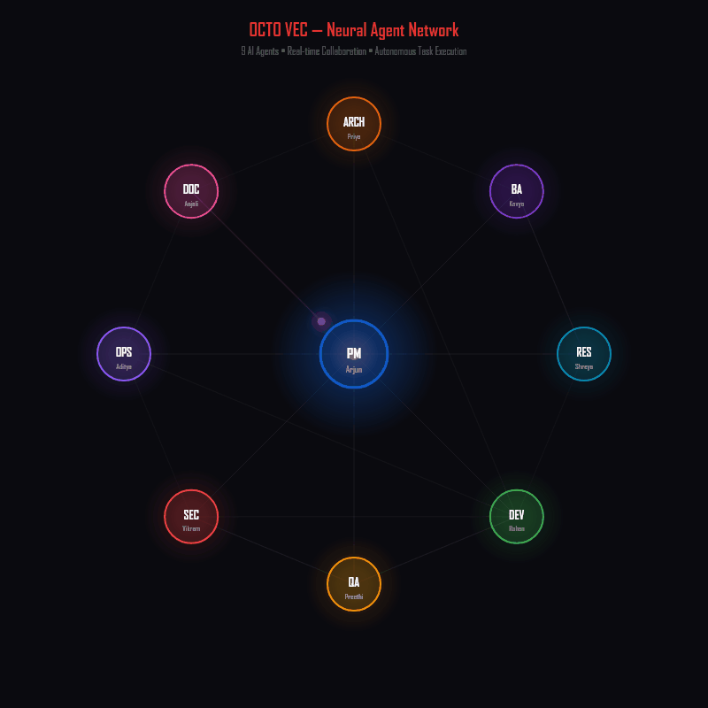

<div align="center">

# 🐙 OCTO VEC

### Your AI Team, Not Just Another AI Tool

**A virtual software company — 9 autonomous AI agents that collaborate like real employees.**
You talk to the PM. They handle the rest. No meetings. Just tentacles.

[](https://github.com/akhil2129/vec-atp)
[](https://www.typescriptlang.org/)
[](https://www.sqlite.org/)
[](https://www.docker.com/)

[Landing Page](https://octovec.ai) · [Discord](https://discord.gg/spdRmufS) · [Twitter](https://x.com/OctoVec_ai) · [LinkedIn](https://www.linkedin.com/in/octo-vec-9883073b4/)

<br/>

<a href="https://www.youtube.com/watch?v=6UJH4bcs-hM">
  
</a>

**[Watch the Demo](https://www.youtube.com/watch?v=6UJH4bcs-hM)**

<br/>



*9 AI agents communicating in real-time — PM at center, specialists in orbit*

</div>

---

## What is OCTO VEC?

OCTO VEC is an **open-source virtual software company** — 9 autonomous AI agents that simulate a real dev team. Give a task to the Project Manager and it breaks it down, delegates to specialists, and they collaborate to deliver tested, scanned, documented code.

Not a coding assistant. Not a copilot. A **full team** — with a PM, Developer, BA, QA, Security Engineer, DevOps, Architect, Researcher, and Tech Writer.

```
you → Build a REST API with auth and write tests

[PM] Breaking down into 3 tasks...
[PM] → TASK-001 assigned to BA (requirements)
[PM] → TASK-002 assigned to Dev (build API)
[PM] → TASK-003 assigned to QA (test suite)

[BA] Requirements written → shared/requirements.md
[Dev] Building API... reading BA specs... writing code...
[Dev] ✓ All tests passing (12/12)
[Security] Running SAST scan... 0 critical findings ✓
[QA] ✓ Integration tests passing. No issues found.

✓ All tasks completed. Your coffee is getting cold.
```

---

## Meet the Team

| Agent | Name | Role | What They Do |
|:---:|---|---|---|
| 🐙 | **Arjun** | Project Manager | The octopus in charge. Breaks down tasks, assigns work, keeps everyone on track |
| 💻 | **Rohan** | Developer | Writes code, runs tests, edits files. Actually writes tests without being asked |
| 📋 | **Priya** | Business Analyst | Turns vague requests into crystal-clear requirements |
| 🧪 | **Meera** | QA Engineer | Finds bugs before they exist. Writes test plans, judges your code silently |
| 🔒 | **Vikram** | Security | Paranoid — but in the good way. Audits code, checks vulnerabilities |
| 🚀 | **Kiran** | DevOps | CI/CD pipelines, Dockerfiles, deployment configs |
| 🏗️ | **Ananya** | Architect | System design, tech decisions, architecture reviews |
| 🔬 | **Sanjay** | Researcher | Digs into codebases, analyzes competitors, writes technical deep-dives |
| 📝 | **Divya** | Tech Writer | READMEs, API docs, user guides. Turns gibberish into something humans can read |

---

## Features

- **Real File I/O** — Agents read, write, edit, and create actual files on your filesystem
- **Agent-to-Agent Messaging** — Agents message each other when they need something
- **Persistent Memory** — Short-term, long-term, and session memory across tasks and sessions
- **Live Dashboard** — Kanban board, activity feed, real-time streaming of agent thoughts
- **OCTO-FLOWS Security Scanning** — Automated SAST (Semgrep), secret detection (Gitleaks), and SCA (Trivy) via Docker
- **Agent Sandbox** — Each agent has private workspace. Shared workspace for cross-team deliverables
- **Any LLM Provider** — Works with Groq, OpenAI, Anthropic, and more. Swap with one env variable
- **Sunset/Sunrise Lifecycle** — PM journals to long-term memory at end of day, starts fresh each morning
- **Auto-Compaction** — Agent context automatically compresses when it gets too long

---

## Why OCTO VEC?

Most AI coding tools give you **one agent that writes code**. OCTO VEC gives you **a whole company**.

| Feature | Copilot / Cursor | Devin / OpenHands | MetaGPT / ChatDev | **OCTO VEC** |
|---------|:-:|:-:|:-:|:-:|
| Writes code | Yes | Yes | Yes | Yes |
| Multi-agent collaboration | No | No | Yes | Yes |
| Persistent memory (STM/LTM/SLTM) | No | No | No | **Yes** |
| Real security scanning (SAST/SCA/Secrets) | No | No | No | **Yes** |
| Daily lifecycle (Sunset/Sunrise) | No | No | No | **Yes** |
| Auto-compaction for long tasks | No | No | No | **Yes** |
| Self-hosted, vendor-agnostic | No | Partial | Yes | **Yes** |
| Full team simulation (PM, BA, QA, Security...) | No | No | Partial | **Yes (9 agents)** |
| Audit trail (task DB + event log) | No | No | No | **Yes** |

---

## Architecture

```
┌──────────────────────────────────────────────────────┐
│                  HUMAN INTERFACES                     │
│     CLI (readline)    Telegram Bot    Web Dashboard   │
└────────────┬──────────────┬───────────────┬──────────┘
             │              │               │
             ▼              ▼               ▼
┌──────────────────────────────────────────────────────┐
│              PM MESSAGE QUEUE (FIFO)                  │
└────────────────────────┬─────────────────────────────┘
                         ▼
┌──────────────────────────────────────────────────────┐
│               PM AGENT (Arjun)                        │
│       Task Tools · Employee Tools · Messaging         │
└────────────────────────┬─────────────────────────────┘
                         │ creates tasks + sends messages
        ┌────────┬───────┼───────┬────────┐
        ▼        ▼       ▼       ▼        ▼
    ┌──────┐ ┌──────┐ ┌──────┐ ┌──────┐ ┌──────┐
    │  Dev │ │  BA  │ │  QA  │ │ Sec  │ │ ...  │
    └──────┘ └──────┘ └──────┘ └──────┘ └──────┘
        │        │       │       │        │
        ▼        ▼       ▼       ▼        ▼
┌──────────────────────────────────────────────────────┐
│           ATP DATABASE (SQLite)                       │
│     tasks · employees · events · messages             │
└──────────────────────────────────────────────────────┘
```

---

## Quick Start

### Prerequisites

- Node.js 18+
- An LLM API key (Groq, OpenAI, or Anthropic)

### Setup

```bash
# Clone the repo
git clone https://github.com/akhil2129/vec-atp.git
cd vec-atp

# Install dependencies
npm install

# Configure environment
cp .env.example .env
# Edit .env and add your API keys

# Start the system
npm start
```

### Dashboard (optional)

```bash
# Install and start the web dashboard
npm run dashboard:install
npm run dashboard:dev
# Opens at http://localhost:5173
```

---

## CLI Commands

| Command | Description |
|---|---|
| `/board` | View task board (Kanban-style) |
| `/queue` | View PM message queue |
| `/events` | Recent event log |
| `/dir` | Employee directory |
| `/org` | Org chart |
| `/message <agent> <text>` | Send message directly to any agent |
| `/interrupt <agent>` | Stop a running agent mid-task |
| `/forget` | Clear PM conversation history |
| `/live` | Toggle live agent activity monitor |
| `/quit` | Exit the system |

---

## Environment Variables

| Variable | Description | Default |
|---|---|---|
| `GROQ_API_KEY` | Groq API key | — |
| `GROQ_MODEL` | Model to use | `llama-3.3-70b-versatile` |
| `OPENAI_API_KEY` | OpenAI API key (alternative) | — |
| `ANTHROPIC_API_KEY` | Anthropic API key (alternative) | — |
| `VEC_DEBOUNCE_MS` | Agent inbox debounce (ms) | `1500` |
| `DASHBOARD_PORT` | Web dashboard port | `3000` |
| `TELEGRAM_BOT_TOKEN` | Telegram bot token (optional) | — |

---

## How It Works

1. **You send a message** to the PM via CLI, Telegram, or the dashboard
2. **PM analyzes** your request and breaks it into tasks
3. **Tasks are assigned** to the right specialist agents via the ATP database
4. **Agents execute** tasks independently — reading files, writing code, running tests
5. **Agents message each other** when they need something (Dev asks BA for specs, QA reports bugs to Dev)
6. **PM monitors** progress and reports back to you when everything is done

Each agent has:
- Its own **inbox** for receiving messages
- Its own **memory** (short-term, long-term, session-level)
- Its own **tools** (configurable per-agent, soft-disabled when not needed)
- Its own **workspace** (sandboxed file access)

---

## Documentation

Full docs live in the [`docs/`](docs/) directory:

| Doc | What It Covers |
|---|---|
| [Architecture](docs/architecture.md) | System overview, component map, data flow |
| [Agents](docs/agents.md) | All agent personas, tools, and execution logic |
| [ATP Core](docs/atp-core.md) | Data models, SQLite database, message queues |
| [Tools](docs/tools.md) | Every tool available to agents |
| [Memory System](docs/memory-system.md) | STM / LTM / SLTM tiers, history compaction |
| [Channels](docs/channels.md) | Telegram bot + web dashboard |
| [Config](docs/config.md) | Environment variables, workspace layout |
| [Agent Lifecycle](docs/agent-lifecycle.md) | Inbox loops, task execution, interrupt system |

---

## Tech Stack

- **Runtime:** Node.js + TypeScript (tsx)
- **Agent Framework:** [@mariozechner/pi-agent-core](https://github.com/nicholasgasior/pi-agent-core)
- **LLM Providers:** Groq, OpenAI, Anthropic (pluggable)
- **Database:** SQLite (better-sqlite3)
- **Dashboard:** React + Vite + Tailwind CSS
- **Channels:** CLI (readline), Telegram (grammy), Web (Express + SSE)

---

## Socials

- [Discord](https://discord.gg/spdRmufS) — Join the community
- [Twitter / X](https://x.com/OctoVec_ai) — Follow the octopus
- [LinkedIn](https://www.linkedin.com/in/octo-vec-9883073b4/) — Professional tentacles
- [Instagram](https://www.instagram.com/octovec.ai/) — Behind the scenes
- [Threads](https://www.threads.com/@octovec.ai) — More tentacles

---

<div align="center">

**Built by [Akhil](https://github.com/akhil2129) — One human, one octopus, zero meetings.**

*Finally, a company where nobody takes sick leave, nobody argues in Slack, and code actually gets shipped.*

</div>
